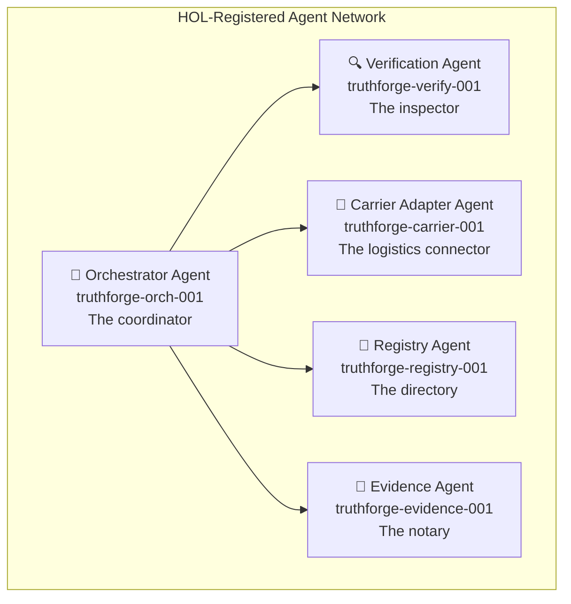
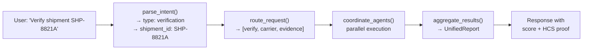
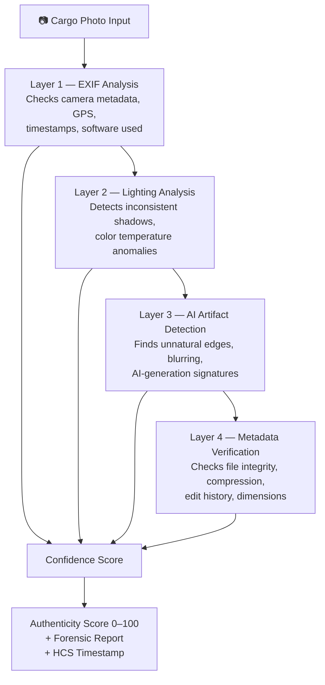
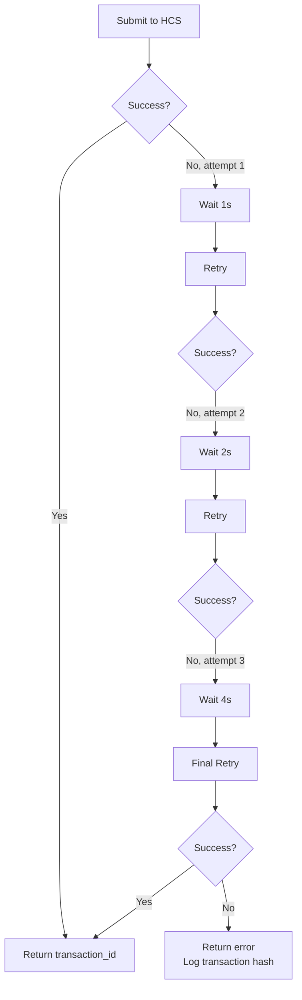
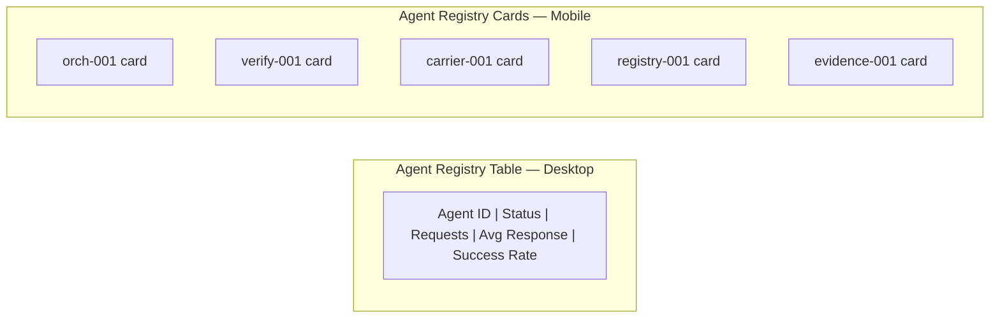

## Overview

TruthForge runs on a network of **5 specialized AI agents**, each registered with a unique identity on Hedera's Hashgraph Online (HOL) protocol. Think of them as a team of experts — each one handles a specific job, and the Orchestrator coordinates them all.



All agents share a common base class (`BaseAgent`) that provides:
- HOL registration via `register_with_hol()`
- HCS-10 message sending/receiving
- Health check reporting
- Request metrics tracking

---

## Agent 1: Orchestrator (`orch-001`)

**Role:** The central brain. Every request enters through the Orchestrator.

**What it does:**
- Parses natural language messages to understand what the user wants
- Decides which agents need to be involved
- Runs agents in parallel and waits for results
- Combines all results into a single unified report
- Handles failures gracefully with retry logic

**Key methods:**

| Method | What it does |
|--------|-------------|
| `parse_intent(message)` | Reads a user message and figures out what they want (verify, track, check status) |
| `route_request(intent)` | Decides which agents to call based on the intent |
| `coordinate_agents(agents, data)` | Calls multiple agents and collects their results |
| `aggregate_results(results)` | Combines all agent outputs into one clean report |
| `handle_agent_failure(agent_id, error)` | Logs failures and tries alternate agents |
| `process_order(order_payload)` | Full order-to-shipment workflow for WooCommerce orders |

**Workflow example:**



---

## Agent 2: Verification & Compliance (`verify-001`)

**Role:** The inspector. Analyzes cargo photos and shipping documents for fraud.

**What it does:**
- Runs the **4-layer deepfake detection pipeline** on cargo photos
- Extracts and validates Bill of Lading (BOL) fields
- Cross-references BOL data against actual carrier records
- Flags discrepancies with severity levels
- Generates forensic reports with confidence scores

**The 4-Layer Pipeline:**



**Score interpretation:**

| Score Range | Meaning |
|-------------|---------|
| 80–100 | ✅ Authentic — high confidence |
| 60–79 | ⚠️ Suspicious — manual review recommended |
| 0–59 | ❌ Likely manipulated — flag for investigation |

---

## Agent 3: Carrier Adapter (`carrier-001`)

**Role:** The logistics connector. Talks to shipping carriers and normalizes their data.

**What it does:**
- Connects to FedEx, UPS, DHL, and other carrier APIs
- Identifies the carrier from a tracking number format
- Normalizes all carrier data into a single unified schema
- Handles rate limits and authentication per carrier
- Returns mock data in development mode

**Supported carriers:**

| Carrier | Auth Method | Tracking Format |
|---------|-------------|-----------------|
| FedEx | OAuth 2.0 | 12–22 digit numeric |
| UPS | API Key | `1Z` + 16 alphanumeric |
| DHL | API Key | 10–11 digit numeric |

**Unified schema output:**

```json
{
  "origin": "Shanghai, CN",
  "destination": "Los Angeles, US",
  "current_status": "In Transit",
  "estimated_delivery": "2026-02-15T18:00:00Z",
  "carrier": "FedEx",
  "tracking_number": "123456789012",
  "last_update": "2026-02-12T09:30:00Z"
}
```

---

## Agent 4: Registry & Discovery (`registry-001`)

**Role:** The directory. Keeps track of all agents and their health.

**What it does:**
- Syncs with the HOL registry to discover available agents
- Monitors the health of all 5 agents continuously
- Responds to `DISCOVER` messages with matching agent capabilities
- Caches agent info with TTL to reduce HOL queries
- Updates agent status when agents go offline

**Health status values:**

| Status | Meaning |
|--------|---------|
| `ONLINE` | Agent is registered and responding |
| `BUSY` | Agent is processing a request |
| `OFFLINE` | Agent is not responding |
| `ERROR` | Agent error rate > 50% |

---

## Agent 5: Evidence & Settlement (`evidence-001`)

**Role:** The notary. Creates tamper-proof records on the Hedera blockchain.

**What it does:**
- Submits verification results to Hedera HCS as consensus messages
- Generates unique audit reference numbers for every verification
- Maintains a full audit trail linking results to original requests
- Tracks HBAR costs per transaction in Live Mode
- Implements exponential backoff retry for failed transactions

**Audit reference format:**

```
AUDIT-{verification_id}-{timestamp}
```

**Retry logic:**



---

## Agent Health Dashboard

The Registry Agent exposes real-time health data for all agents, displayed in the frontend as a table (desktop) or cards (mobile).



Each entry shows:
- Current status (ONLINE / BUSY / OFFLINE / ERROR)
- Requests processed today
- Average response time (seconds)
- Success rate (%)
- Last heartbeat timestamp
