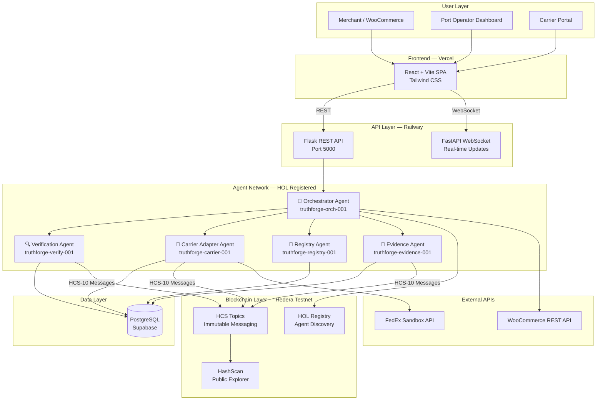
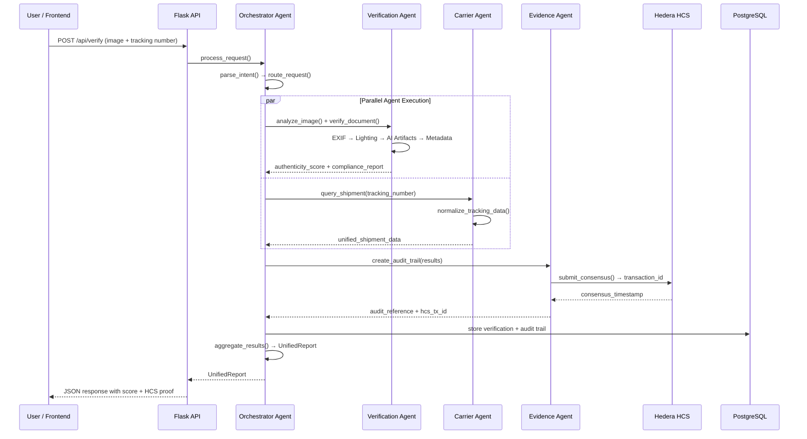
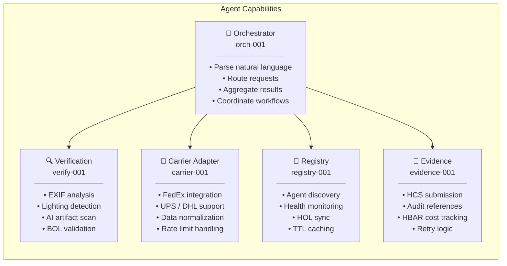
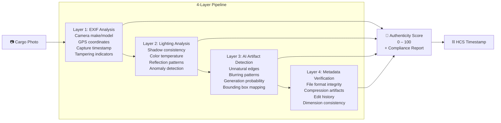
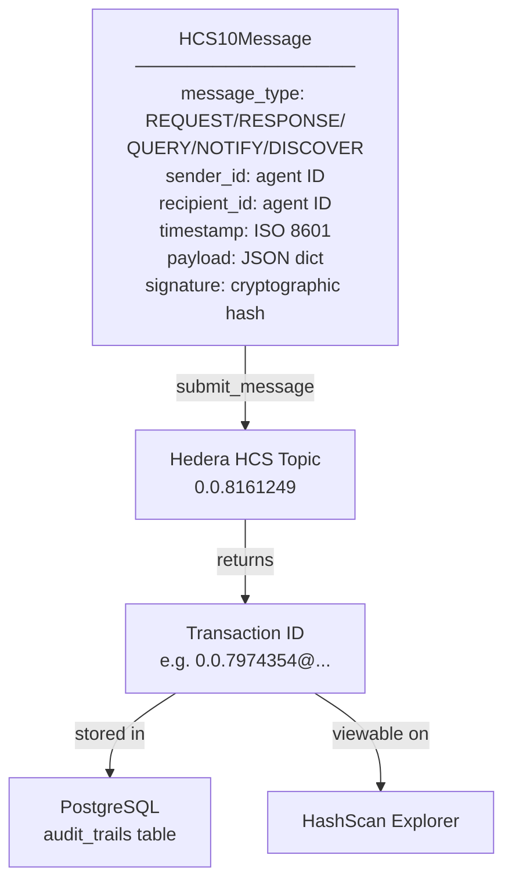
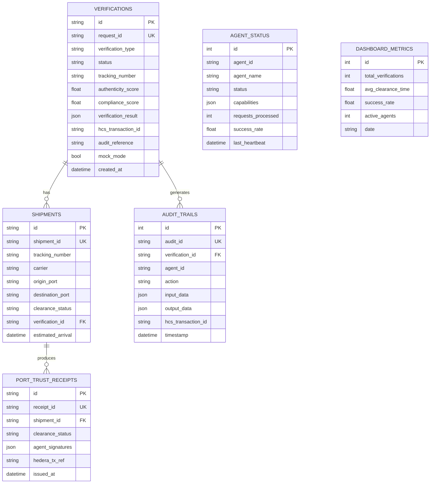
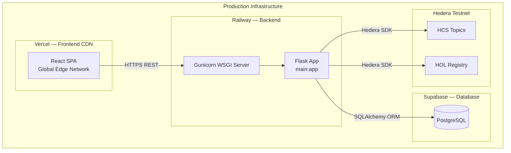
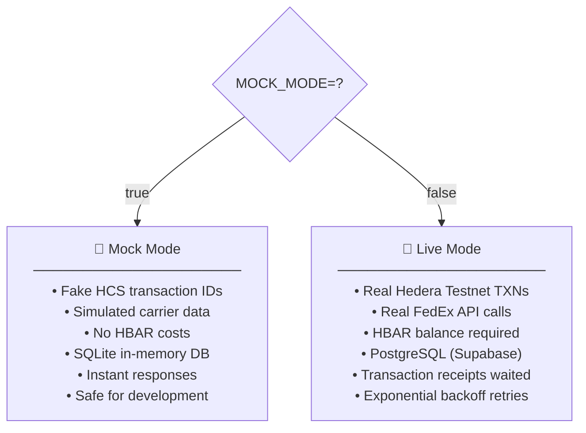

## High-Level Architecture

TruthForge is built as a **layered system**. A user request flows from the browser, through a REST API, into an orchestrator that coordinates 5 specialized AI agents, and ends with a tamper-proof record on the Hedera blockchain.

## Request Lifecycle

This is what happens from the moment a user submits a verification request to when they receive a result.

## Component Breakdown

### The 5-Agent Network

Each agent is independently registered on Hedera's HOL (Hashgraph Online) protocol, making them discoverable and independently scalable.

### 4-Layer Deepfake Detection

The Verification Agent runs every cargo photo through 4 independent analysis layers. Each layer produces a confidence score; they are combined into a final **Authenticity Score (0–100)**.

### HCS-10 Messaging Protocol

All agent-to-agent communication uses the HCS-10 standard — every message is submitted to a Hedera topic, creating an immutable audit trail.

## Database Schema

## Deployment Architecture

## Mock vs Live Mode

TruthForge supports two operating modes, switchable via a single environment variable.

