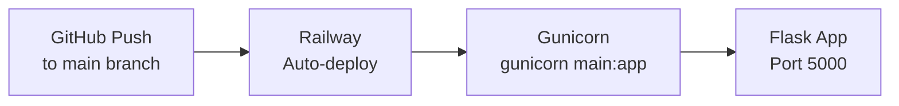
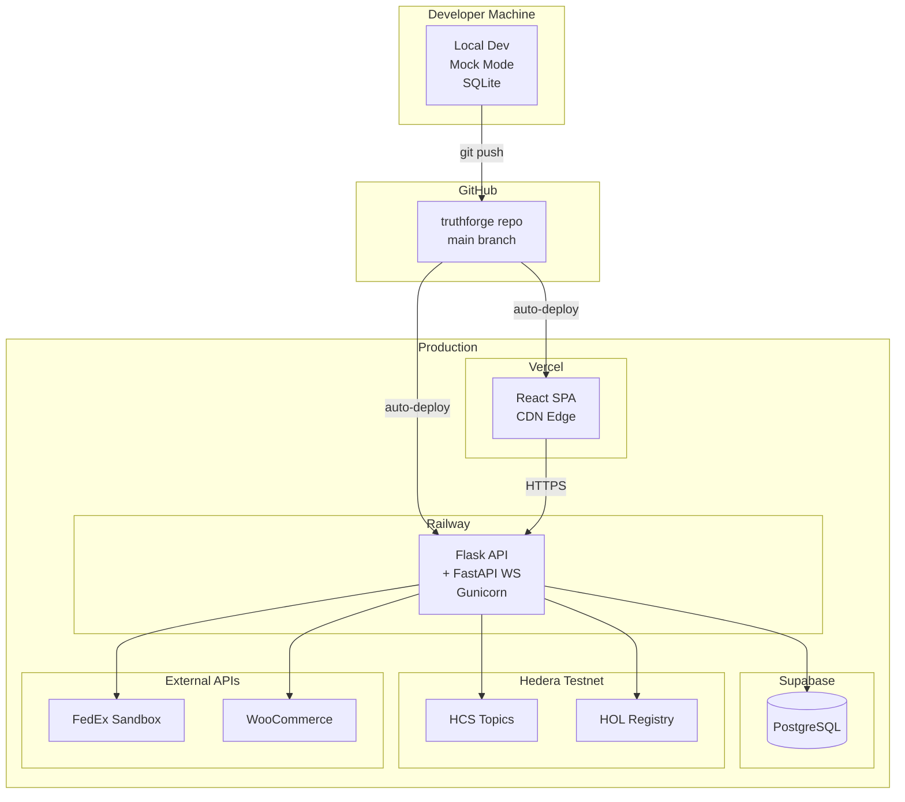

## Prerequisites

- Python 3.9+
- Node.js 18+
- A Hedera Testnet account ([create one free](https://portal.hedera.com))
- PostgreSQL (or use SQLite for local dev)

---

## Quick Start (Mock Mode)

Mock Mode lets you run the full system without any blockchain credentials or API keys. Perfect for development and demos.

<Steps>
  <Step title="Clone the repository">
    ```bash
    git clone https://github.com/Ai-Tech-Haven/truthforge.git
    cd truthforge
    ```
  </Step>

  <Step title="Install Python dependencies">
    ```bash
    pip install -r requirements.txt
    ```
  </Step>

  <Step title="Configure environment">
    ```bash
    cp .env.example .env
    # MOCK_MODE=true is already set in .env.example
    # No other credentials needed for mock mode
    ```
  </Step>

  <Step title="Initialize the database">
    ```bash
    python init_database.py
    ```
  </Step>

  <Step title="Start the backend">
    ```bash
    python main.py
    # API running at http://localhost:5000
    ```
  </Step>

  <Step title="Start the frontend (separate terminal)">
    ```bash
    cd truthforge_frontend/truthforge-logistics-verified-main
    npm install
    npm run dev
    # Dashboard at http://localhost:8080
    ```
  </Step>
</Steps>

---

## Environment Variables

Full reference for all configuration options:

### Hedera Configuration

| Variable | Required | Description |
|----------|----------|-------------|
| `HEDERA_ACCOUNT_ID` | Live only | Your Hedera account (e.g. `0.0.7974354`) |
| `HEDERA_PRIVATE_KEY` | Live only | DER-encoded private key |
| `HEDERA_NETWORK` | Yes | `testnet` or `mainnet` |
| `HCS_TOPIC_ID` | Live only | HCS topic for agent messaging |
| `HOL_REGISTRY_ENDPOINT` | Live only | HOL registry URL |
| `REGISTRY_BROKER_API_KEY` | Live only | From [portal.hashgraphonline.com](https://portal.hashgraphonline.com) |

### Carrier APIs

| Variable | Required | Description |
|----------|----------|-------------|
| `FEDEX_API_KEY` | Live only | FedEx developer API key |
| `FEDEX_SECRET_KEY` | Live only | FedEx secret |
| `FEDEX_ACCOUNT_NUMBER` | Live only | FedEx account number |
| `FEDEX_ENVIRONMENT` | Yes | `sandbox` or `production` |

### WooCommerce

| Variable | Required | Description |
|----------|----------|-------------|
| `WOOCOMMERCE_STORE_URL` | Optional | Your store URL |
| `WOOCOMMERCE_CONSUMER_KEY` | Optional | REST API consumer key |
| `WOOCOMMERCE_CONSUMER_SECRET` | Optional | REST API consumer secret |
| `WOOCOMMERCE_WEBHOOK_SECRET` | Optional | Webhook signature validation |

### System

| Variable | Default | Description |
|----------|---------|-------------|
| `MOCK_MODE` | `true` | `true` = no real API calls |
| `PORT` | `5000` | API server port |
| `LOG_LEVEL` | `INFO` | `DEBUG`, `INFO`, `WARNING`, `ERROR` |
| `MAX_RETRIES` | `3` | Max retry attempts |
| `TIMEOUT_SECONDS` | `30` | Request timeout |
| `DATABASE_URL` | SQLite | PostgreSQL connection string |
| `API_AUTH_TOKEN` | — | Token for protected endpoints |

---

## Production Deployment

### Backend — Railway



The `Procfile` configures Railway:

```
web: gunicorn main:app --bind 0.0.0.0:$PORT --workers 2 --timeout 120
```

The `nixpacks.toml` sets the Python version:

```toml
[phases.setup]
nixPkgs = ["python39"]
```

**Required Railway environment variables:** Set all `HEDERA_*`, `FEDEX_*`, and `DATABASE_URL` variables in the Railway dashboard.

### Frontend — Vercel

```bash
# From the frontend directory
vercel --prod
```

Or connect your GitHub repo to Vercel for automatic deployments on push.

**Required Vercel environment variables:**
```
VITE_API_BASE_URL=https://your-railway-app.railway.app
VITE_WS_BASE_URL=wss://your-railway-app.railway.app
```

### Database — Supabase

1. Create a new Supabase project
2. Copy the PostgreSQL connection string
3. Set `DATABASE_URL=postgresql://...` in Railway
4. Run migrations: `python migrate_database.py`

---

## Creating a Hedera HCS Topic

Run the included script to create your HCS topic:

```bash
node create_hedera_topic.js
# Outputs: Created topic: 0.0.XXXXXXX
# Add this to .env as HCS_TOPIC_ID=0.0.XXXXXXX
```

## Registering Agents on HOL

```bash
node register-agents.js
# Registers all 5 agents on Hedera HOL
# Outputs transaction IDs for each agent
```

## Verifying Setup

```bash
python verify_setup.py
# Checks: database, Hedera connection, agent registration, API health
```

---

## Infrastructure Diagram


