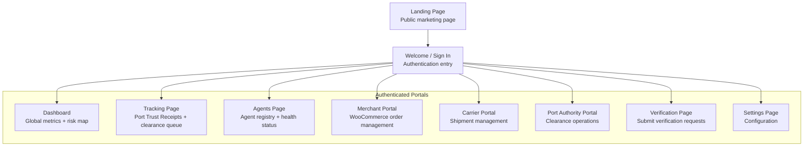
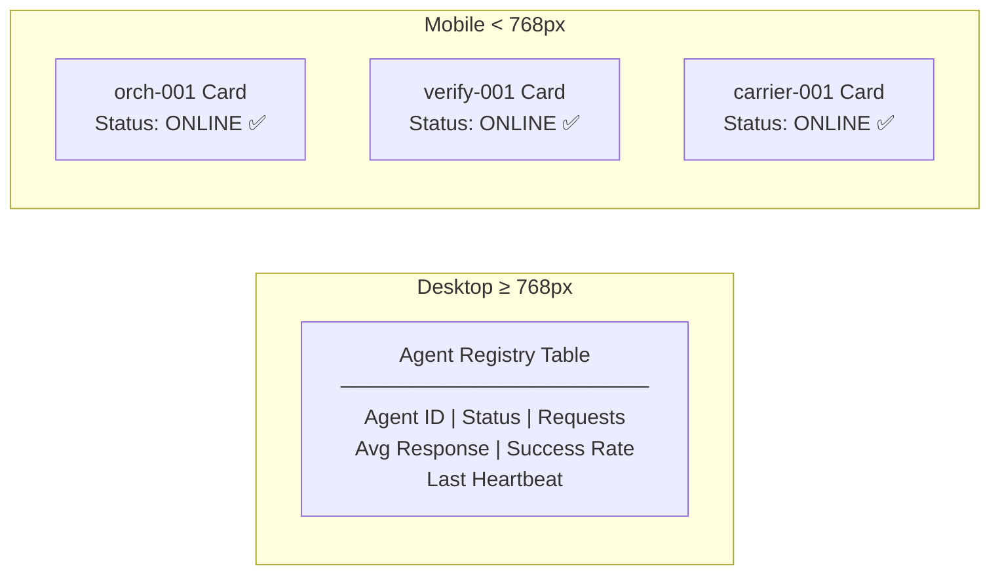
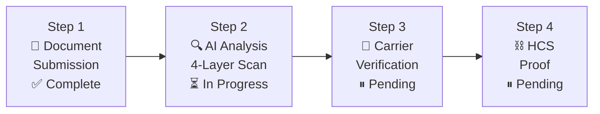
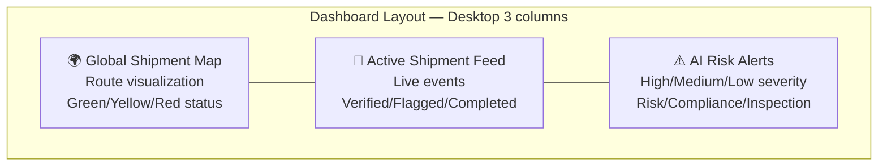
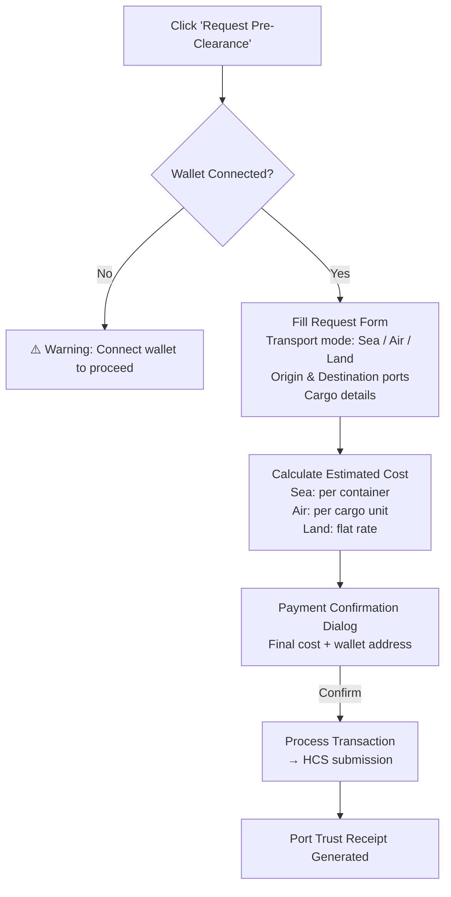

## Overview

The TruthForge frontend is a **React + Vite** single-page application deployed on Vercel. It's fully responsive — adapting its layout for desktop, tablet, and mobile devices.

**Live URL:** [https://truthforge-frontend.vercel.app](https://truthforge-frontend.vercel.app)

## Pages & Portals



---

## Key Components

### Agent Registry (Responsive)

The agent registry adapts based on screen size:



### Port Trust Receipt Card

Displayed during active verifications. Shows the 4-step verification process with real-time status updates.



### Global Trade Risk Command Center

The main dashboard component showing:
- **Global Shipment Map** — route visualization with color-coded risk status
- **Active Shipment Feed** — live event stream with timestamps
- **AI Risk Alerts** — severity-ranked alerts (high/medium/low)



### Pre-Clearance Request Modal

Merchants and port operators can submit pre-clearance requests with integrated wallet payment.



### Container Intelligence Panel

Displays container-level verification data for a vessel:

- **Vessel Trust Score** (0–100) — calculated from container verification rate
- **Container Visualization Grid** — color-coded squares (green = verified, red = flagged, gray = pending)
- **Container Verification Table** — scrollable list with status and risk level badges

---

## Tech Stack

| Layer | Technology |
|-------|-----------|
| Framework | React 18 + TypeScript |
| Build tool | Vite |
| Styling | Tailwind CSS |
| UI Components | shadcn/ui |
| State management | React Context API |
| Routing | React Router |
| WebSocket | Native WebSocket API |
| Testing | Vitest |
| Deployment | Vercel |

## Environment Variables

```bash
# .env.production
VITE_API_BASE_URL=https://your-railway-app.railway.app
VITE_WS_BASE_URL=wss://your-railway-app.railway.app
VITE_MOCK_MODE=false
```

## Local Development

```bash
cd truthforge_frontend/truthforge-logistics-verified-main
npm install
npm run dev
# → http://localhost:8080
```

## Build & Deploy

```bash
npm run build
# Vercel auto-deploys on push to main branch
```

The `vercel.json` at the project root handles SPA routing redirects:

```json
{
  "rewrites": [{ "source": "/(.*)", "destination": "/index.html" }]
}
```
