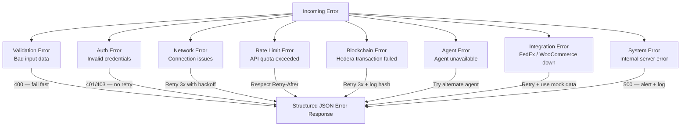
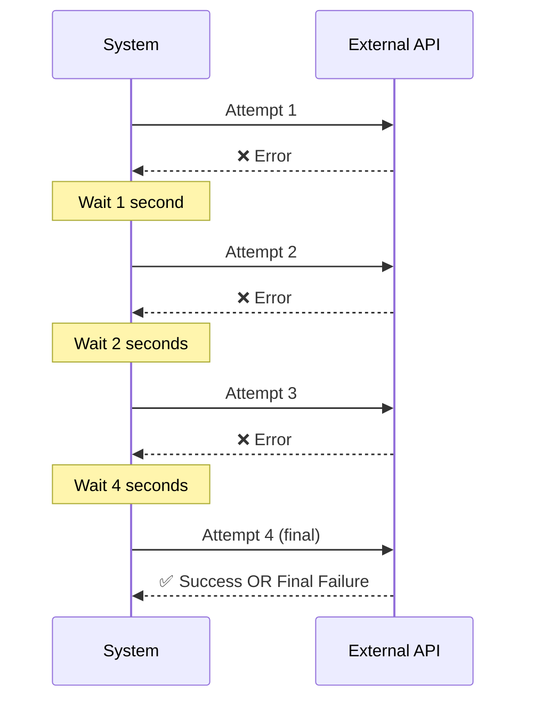
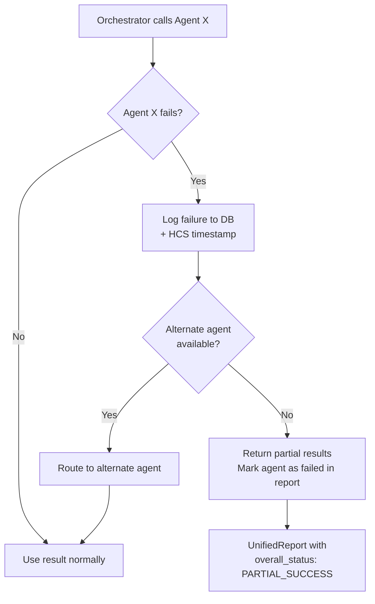
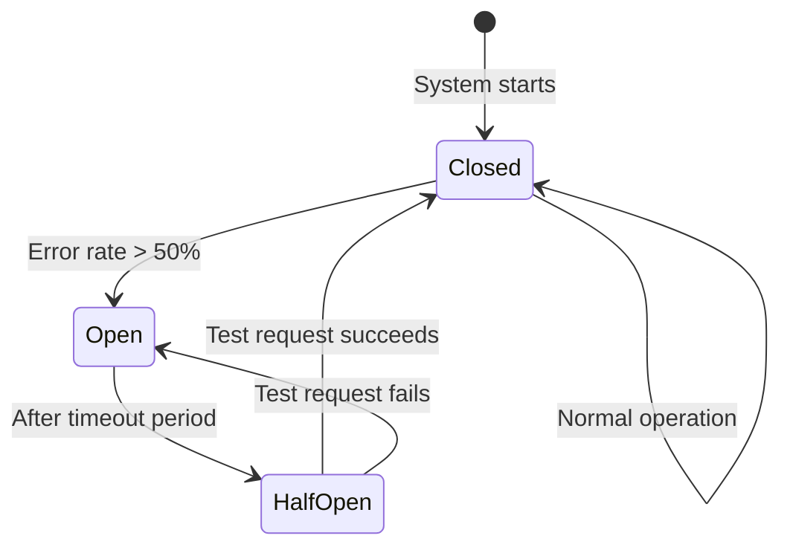

## Error Categories

TruthForge classifies errors into 8 categories, each with a specific handling strategy.



---

## Retry Strategy

### Exponential Backoff

Network errors, blockchain failures, and integration errors all use exponential backoff:



**Retry configuration:**

| Error Type | Max Retries | Backoff | Notes |
|------------|-------------|---------|-------|
| Network errors | 3 | 1s → 2s → 4s | Log each attempt |
| Blockchain errors | 3 | 1s → 2s → 4s | Log transaction hash |
| Rate limit errors | Varies | Respect `Retry-After` header | Add jitter |
| Integration errors | 3 | 1s → 2s → 4s | Cache successful responses |

---

## Agent Failure Handling

When an agent fails, the Orchestrator doesn't crash — it degrades gracefully.



**Key behavior:**
- The Orchestrator always returns a response, even if some agents fail
- `confidence_level` in the UnifiedReport reflects the % of agents that succeeded
- Failed agents are logged to the `audit_trails` table with full error details
- The Registry Agent detects failures and updates agent status to `ERROR`

---

## Circuit Breaker Pattern

For repeated failures from the same service, TruthForge implements a circuit breaker to stop hammering a failing service:



---

## Logging Strategy

All logs are structured JSON with consistent fields:

```json
{
  "timestamp": "2026-02-12T10:00:00Z",
  "level": "ERROR",
  "component": "truthforge-verify-001",
  "request_id": "req-001",
  "message": "EXIF analysis failed for image img-001",
  "context": {
    "image_id": "img-001",
    "error": "PIL.UnidentifiedImageError",
    "retry_count": 2
  }
}
```

**Log levels:**

| Level | When to use |
|-------|-------------|
| `DEBUG` | Detailed diagnostics (dev only) |
| `INFO` | Agent actions, request completions |
| `WARNING` | Retries, degraded functionality |
| `ERROR` | Operation failures |
| `CRITICAL` | System-wide failures needing immediate attention |

**Log retention:**

| Environment | Retention |
|-------------|-----------|
| Development | 7 days |
| Production | 30 days |
| Critical errors | 90 days |

---

## Mock Mode Fallback

If Live Mode fails to initialize (e.g., missing Hedera credentials), the system can fall back to Mock Mode:

```python
# In agents/config.py
if not config.hedera_account_id and not config.mock_mode:
    logger.warning("No Hedera credentials — falling back to Mock Mode")
    config.mock_mode = True
```

This ensures the system always starts, even in degraded environments.
