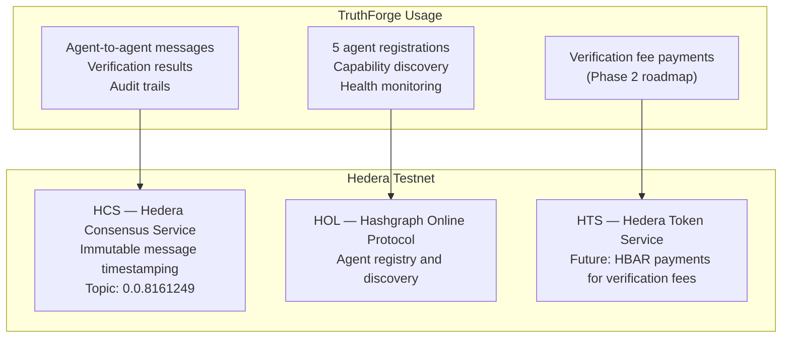
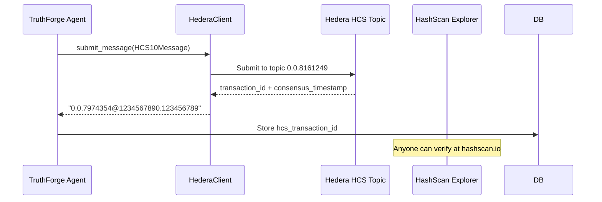
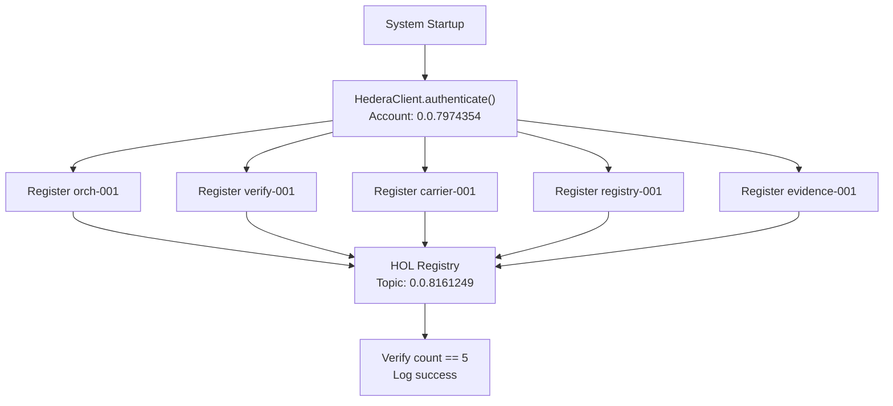
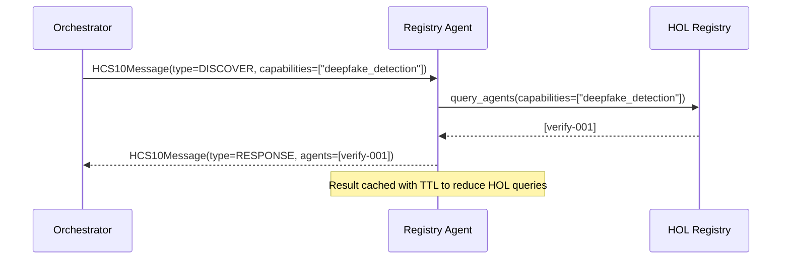
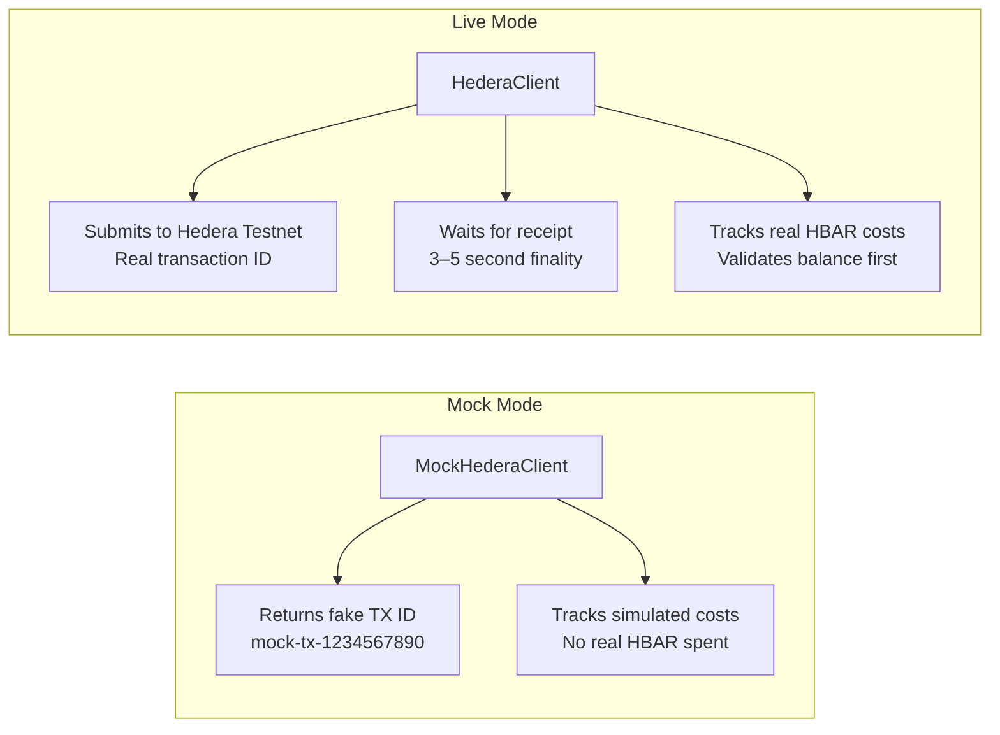

## Why Hedera?

TruthForge uses Hedera Hashgraph because it provides:

- **Finality in seconds** — transactions are confirmed in 3–5 seconds, not minutes
- **Low, predictable fees** — fractions of a cent per transaction
- **Immutability** — once written, records cannot be altered
- **Public verifiability** — anyone can verify a transaction on HashScan

---

## Hedera Services Used



---

## HCS — Hedera Consensus Service

HCS is used to create an **immutable, timestamped record** of every verification event.

### How it works



### What gets written to HCS

Every significant event creates an HCS record:

| Event | Agent | What's recorded |
|-------|-------|----------------|
| Agent registration | All agents | Agent ID, capabilities, timestamp |
| Image analysis complete | Verification Agent | Authenticity score, report hash |
| Carrier data retrieved | Carrier Agent | Tracking number, normalized data hash |
| Audit trail created | Evidence Agent | Verification ID, audit reference |
| Orchestrator report | Orchestrator | Report ID, overall status, agent count |
| Agent failure | Orchestrator | Failed agent ID, error type |

---

## HOL — Hashgraph Online Protocol

HOL is Hedera's agent registry — it's how TruthForge's 5 agents announce themselves to the network and discover each other.

### Agent Registration



### DISCOVER Message Flow

When an agent needs to find another agent with specific capabilities:



---

## HCS-10 Message Protocol

All agent communication follows the HCS-10 standard:

### Message Types

| Type | Direction | Purpose |
|------|-----------|---------|
| `REQUEST` | Agent → Agent | Ask another agent to do something |
| `RESPONSE` | Agent → Agent | Reply to a REQUEST |
| `QUERY` | Agent → HOL | Ask the registry for information |
| `NOTIFY` | Agent → HCS | Broadcast an event (no reply expected) |
| `DISCOVER` | Agent → Registry | Find agents with specific capabilities |

### Message Signature

Every message is cryptographically signed to prevent tampering:

```python
# Signature generation (simplified)
import hmac, hashlib, json

def generate_signature(message: HCS10Message, secret_key: str) -> str:
    content = json.dumps({
        "type": message.message_type,
        "sender": message.sender_id,
        "recipient": message.recipient_id,
        "timestamp": message.timestamp,
        "payload": message.payload
    }, sort_keys=True)
    
    return hmac.new(
        secret_key.encode(),
        content.encode(),
        hashlib.sha256
    ).hexdigest()
```

---

## Live vs Mock Mode



### Switching modes

```bash
# .env
MOCK_MODE=true   # Development — no blockchain costs
MOCK_MODE=false  # Production — real Hedera transactions
```

---

## Viewing Proofs on HashScan

Every verification generates a publicly verifiable blockchain proof:

1. Get the `hcs_transaction_id` from any API response
2. Visit: `https://hashscan.io/testnet/transaction/{hcs_transaction_id}`
3. See the exact timestamp, message content, and consensus proof

**Example:** [View TruthForge audit record on HashScan](https://hashscan.io/testnet/transaction/0.0.7974354)
