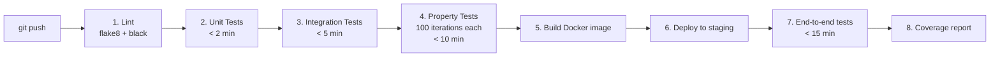

## Testing Philosophy

TruthForge uses a **dual testing approach**:

1. **Unit tests** — verify specific examples, edge cases, and error conditions
2. **Property-based tests** — verify universal properties across all possible inputs (using [Hypothesis](https://hypothesis.readthedocs.io))

Both are necessary. Property tests catch edge cases that unit tests miss; unit tests verify specific behaviors that are hard to express as properties.

---

## Test Structure

```
tests/
├── test_base_agent.py              # BaseAgent registration, messaging
├── test_config.py                  # Config loading and validation
├── test_hcs10_message.py           # HCS-10 message structure
├── test_hedera_client.py           # Mock and live Hedera client
├── test_verification_compliance_agent.py  # 4-layer pipeline
├── test_fedex_adapter.py           # FedEx carrier integration
├── test_fedex_document_integration.py    # BOL + FedEx cross-reference
├── test_marketplace_agent.py       # WooCommerce integration
├── test_orchestrator.py            # Orchestrator routing + aggregation
├── test_orchestrator_integration.py      # End-to-end orchestration
├── test_registry.py                # HOL registry operations
├── test_error_handling.py          # Retry logic, backoff
├── test_api.py                     # Flask API endpoints
├── test_webhook_handler.py         # WooCommerce webhooks
├── test_woocommerce_adapter.py     # WooCommerce REST API
├── test_woocommerce_integration.py # Full WooCommerce flow
├── test_document_verifier.py       # Document verification
├── test_intent_parser.py           # Natural language parsing
└── test_frontend_properties.py     # Responsive UI properties
```

---

## Running Tests

```bash
# All tests
pytest tests/

# With coverage report
pytest tests/ --cov=. --cov-report=html

# Specific test file
pytest tests/test_orchestrator.py -v

# Property tests only (slower — runs 100+ iterations each)
pytest tests/ -k "property" -v
```

---

## Coverage Targets

| Area | Target |
|------|--------|
| Overall | 80%+ |
| Verification pipeline (critical path) | 95%+ |
| Error handling | 90%+ |
| Configuration | 70%+ |

---

## Key Property Tests

Property tests use Hypothesis to generate random inputs and verify that certain properties always hold.

### Property: Authenticity Score Bounds

No matter what image is submitted, the score must always be between 0 and 100.

```python
from hypothesis import given, strategies as st

@given(image_data=st.binary(min_size=1024, max_size=1024*1024))
def test_authenticity_score_bounds(image_data):
    """
    Property 6: For any cargo photo, authenticity_score must be 0–100.
    """
    agent = VerificationComplianceAgent(...)
    result = agent.analyze_image(image_data)
    assert 0 <= result.authenticity_score <= 100
```

### Property: HCS-10 Message Structure

Every message must have all required fields, regardless of content.

```python
@given(
    msg_type=st.sampled_from(MessageType),
    sender=st.text(min_size=1, max_size=50),
    recipient=st.text(min_size=1, max_size=50),
    payload=st.dictionaries(st.text(), st.text())
)
def test_hcs10_message_structure(msg_type, sender, recipient, payload):
    """
    Property 19: All HCS-10 messages must contain required fields.
    """
    msg = HCS10Message(
        message_type=msg_type,
        sender_id=sender,
        recipient_id=recipient,
        payload=payload
    )
    assert msg.message_type is not None
    assert msg.sender_id is not None
    assert msg.recipient_id is not None
    assert msg.timestamp is not None
    assert msg.payload is not None
    assert msg.signature is not None
```

### Property: Carrier Data Normalization

No matter which carrier's raw data format is received, the output must always contain the required unified fields.

```python
@given(carrier=st.sampled_from(["fedex", "ups", "dhl"]),
       raw_data=st.fixed_dictionaries({...}))
def test_carrier_data_normalization(carrier, raw_data):
    """
    Property 9: Carrier data must normalize to unified schema.
    """
    agent = CarrierAdapterAgent(...)
    result = agent.normalize_tracking_data(carrier, raw_data)
    assert "origin" in result
    assert "destination" in result
    assert "current_status" in result
    assert "estimated_delivery" in result
```

---

## 25 Correctness Properties

All 25 correctness properties from the design document have corresponding property tests:

| # | Property | Validates |
|---|----------|-----------|
| 1 | Agent Registration Count — exactly 5 agents | Req 1.1 |
| 2 | Agent Registration Uniqueness — unique IDs | Req 1.2 |
| 3 | Agent Registration Persistence — data unchanged after register | Req 1.3, 1.4 |
| 4 | Agent Re-registration Idempotence — no duplicates | Req 1.5 |
| 5 | Verification 4-Layer Execution — all 4 layers run | Req 2.1–2.4 |
| 6 | Authenticity Score Bounds — always 0–100 | Req 2.5 |
| 7 | Analysis Report Completeness — all sub-reports present | Req 2.6 |
| 8 | HCS Timestamping Consistency — HCS ID always present | Req 2.7, 3.7, 5.1 |
| 9 | Carrier Data Normalization — unified schema | Req 3.1, 3.3 |
| 10 | Multi-Carrier Query Execution — queries appropriate carrier | Req 3.2 |
| 11 | Carrier Error Handling — structured error responses | Req 3.4, 3.5 |
| 12 | Mock Mode Data Simulation — same structure as live | Req 3.6, 12.1–12.5 |
| 13 | Registry Agent Health Monitoring — all 5 agents monitored | Req 4.2, 4.4 |
| 14 | Agent Discovery Response Matching — capabilities match filter | Req 4.6 |
| 15 | Agent Discovery Caching — TTL cache works | Req 4.7 |
| 16 | Evidence Settlement Audit Trail — full trail linked | Req 5.2–5.4 |
| 17 | Transaction Receipt Handling — waits for receipt | Req 5.5, 5.7 |
| 18 | Transaction Retry Logic — exponential backoff | Req 5.6, 13.3 |
| 19 | HCS-10 Message Structure — all required fields | Req 6.1, 6.2 |
| 20 | HCS Message Submission — returns transaction ID | Req 6.3 |
| 21 | Frontend Responsive Behavior — adapts to viewport | Req 8.1, 8.2 |
| 22 | Port Trust Receipt 4-Step Process — steps displayed | Req 8.3 |
| 23 | Dashboard Metrics Display — all metrics shown | Req 10.1, 10.2 |
| 24 | Database Persistence — all fields stored | Req 15.1, 15.5 |
| 25 | Database Mode Segregation — mock/live data separate | Req 15.7 |

---

## CI Pipeline



**Total target: < 30 minutes**
